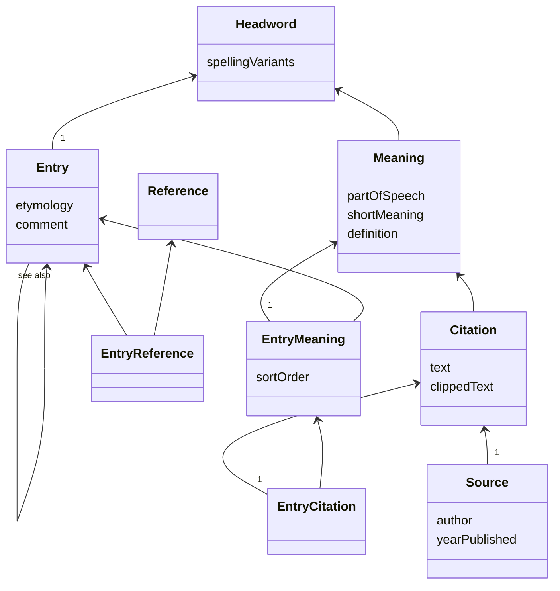

# Dictionary Builder

This repository contains a web application that can be used as a word collection database and online dictionary.

Each *headword* is unique and forms the root of the data structure. A *citation* is a piece of text extracted from a *source* such as a book, website, etc. Citations are collected for the various headwords and each citation relates to one of the *meanings* of a particular headword.

A single dictionary *entry* can be created for each headword. The entry can include some or all of the meanings associated with that headword and some or all of the citations associated with each meaning. *References* can also be created and can then be used in one or more entries.

## Development

### Quick start

1. Start database
   `make startDb`
2. Seed database
   `make createSchema`
   `make seedDatabase`
3. Start Server
   `npm start`
4. Start Client (webpack)
   `npm run dev`

## Architecture

The application uses a 3-tiered architecture

1. Postgres database
2. NodeJS server providing a REST API
3. A React client application

### Database

The database schema can be found in `./server/database/schema.sql`. This file is used to create the schema when running `make createSchema`.

A javascript class for each database entity is located in `./server/database/types/`.

### NodeJS Server

The NodeJS server uses the Express framework to provide a REST API for interacting with the data in the database. The entry point for the server is `./server/index.js` which, when run, starts a web server on the configured port. The API paths are set up in `./server/app.js` along with some middleware modules. Each domain area is mounted as a sub-module using its own Express Router. For example, the entries module `./server/entries/Entries.js` creates an Express router that is mounted at the path `/api/entries/`. The entries module implements all the code that needs to run when a request comes in for a path under `api/entries/`.

### React App

A React app provides the user interface, sending requests from the browser to the API in response to user actions. The entry point for the React app is in `./client/index.js`.  The app is URL-driven and the route to each view is configured in `./client/Routes.jsx`. 