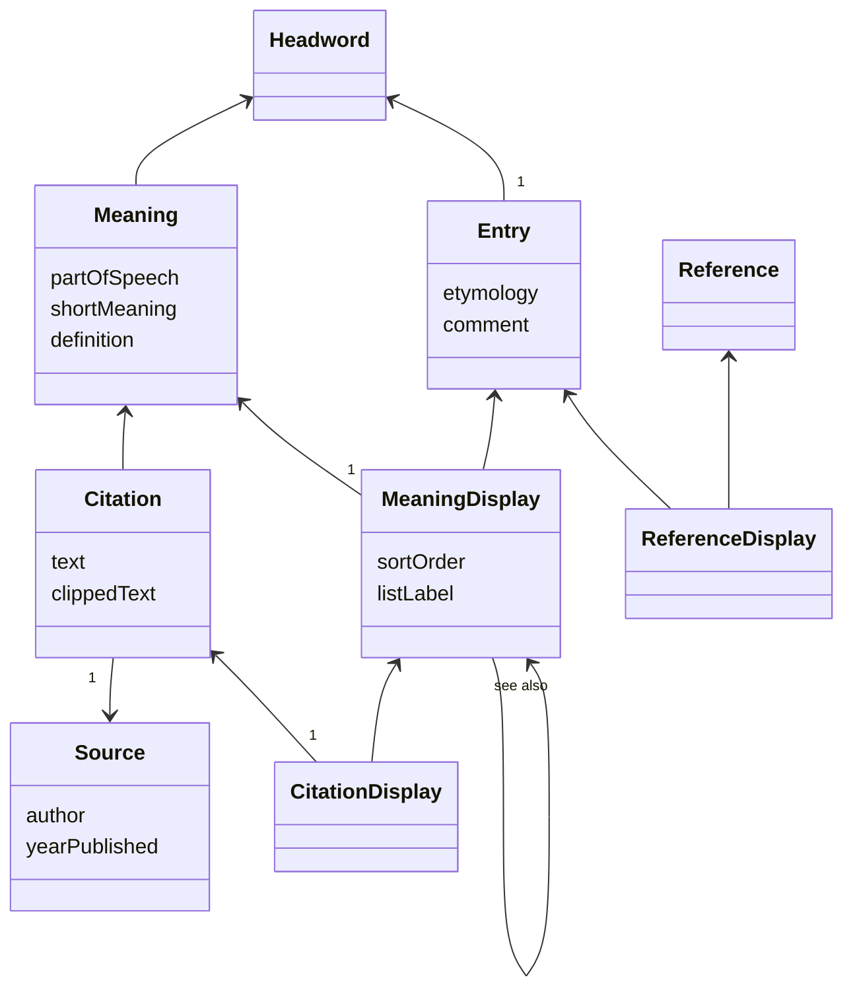

```mermaid
classDiagram
  Headword <-- "1" Entry
  Headword <-- Meaning
  Meaning <-- Citation
  Entry <-- MeaningDisplay
  Meaning <-- "1" MeaningDisplay
  Reference <-- ReferenceDisplay
  Citation "1" --> Source
  Entry <-- ReferenceDisplay
  MeaningDisplay <-- CitationDisplay
  MeaningDisplay "see also" <-- MeaningDisplay
  Citation <-- "1" CitationDisplay
  
  Meaning : partOfSpeech
  Meaning : shortMeaning
  Meaning : definition
  
  Entry : etymology
  Entry : comment
  
  Citation : text
  Citation : clippedText
  
  Source : author
  Source : yearPublished
  
  MeaningDisplay : sortOrder
  MeaningDisplay : listLabel
```

